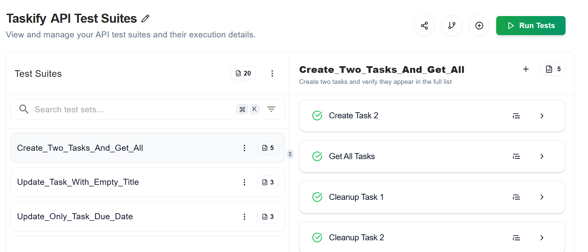

# Task Manager API (Spring Boot)

## 🔗 API Endpoints

- `GET /api/tasks/`
- `POST /api/tasks/`
- `PUT /api/tasks/{id}`
- `DELETE /api/tasks/{id}`

## 🛠 Setup Instructions

1. Clone the repo
2. Setup MySQL DB
3. Add credentials in `application.properties`
4. Run using `./mvnw spring-boot:run`

## 🧪 Sample Request

```bash
curl -X GET http://localhost:9090/api/tasks
```

## ✅ API Testing with Keploy

Keploy recorded and ran tests from real API traffic. Here's a snapshot from the dashboard:



